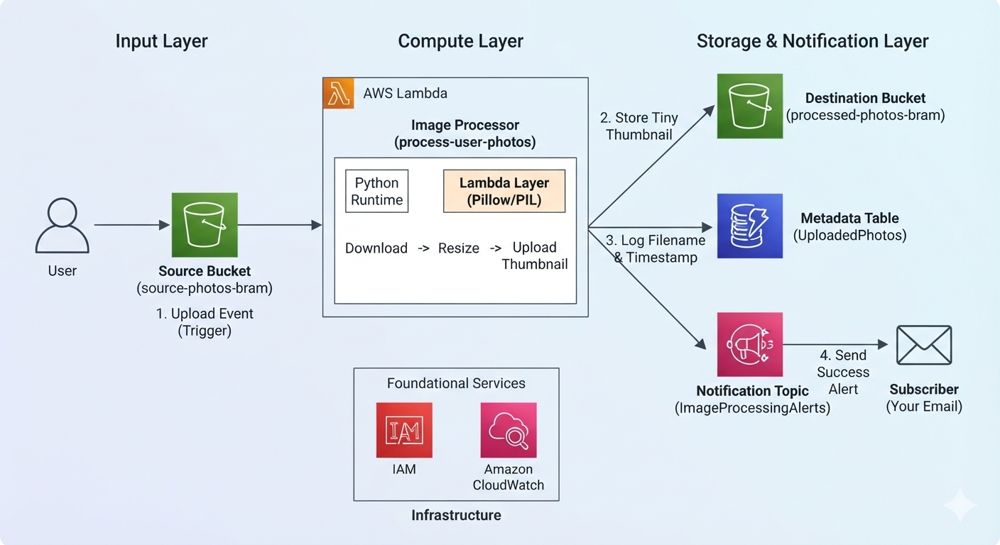
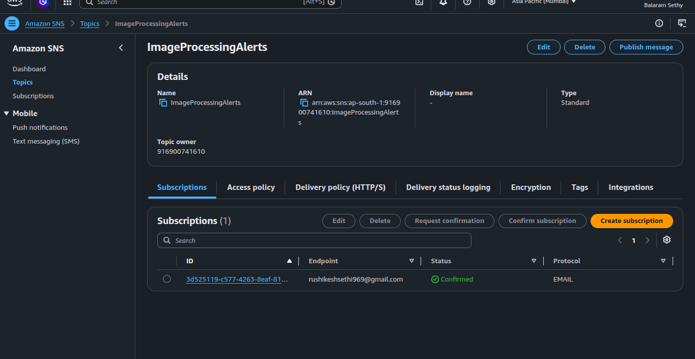
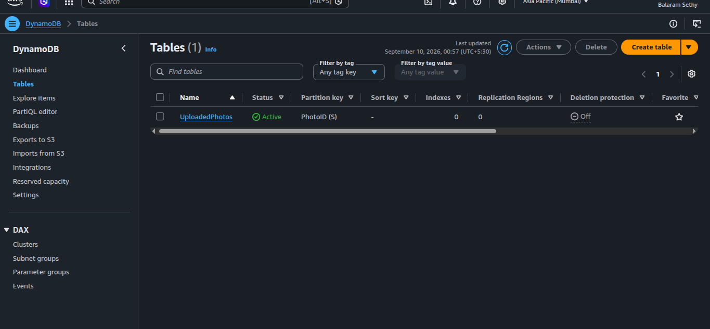
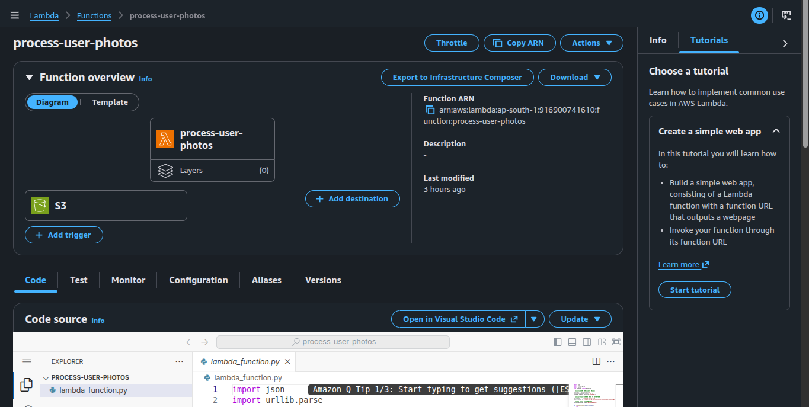
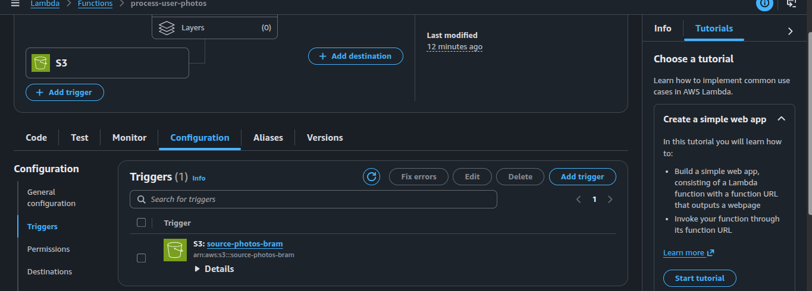

# Serverless Event-Driven Image Processing Pipeline

A hands-on, end-to-end serverless automation pipeline built on AWS (`ap-south-1` region) to process file uploads in real-time. This project handles binary asset storage, database indexing, and automated notifications without managing any persistent server infrastructure.

---

## 🏗️ Architecture Blueprint
Every service interacts asynchronously based on event states:

[User Upload] ──► [S3 Source Bucket]
                         │
                         ▼ (S3 Event Trigger)
                   [AWS Lambda (Python)]
                         │
        ┌────────────────┴────────────────┐
        ▼                                 ▼
[S3 Destination Bucket]           [DynamoDB Table] ──► [SNS Topic] ──► [Your Email]

---

## 🛠️ Infrastructure Services & Roles

*   **Amazon S3 (Input Layer):** `source-photos-bram` – Acts as the landing pad for raw photo files. It is configured with an active event listener to instantly broadcast object changes.
*   **AWS Lambda (Compute Layer):** `process-user-photos` – The serverless runtime container running Python 3.12. It pulls details from the event payload, handles file transfers, and writes records.
*   **Amazon S3 (Output Layer):** `processed-photos-bram` – Acts as the permanent backup storage space for processed files. Separating input/output prevents infinite execution loops.
*   **Amazon DynamoDB (Database Layer):** `UploadedPhotos` – A serverless, high-speed NoSQL database table tracking quick, searchable object text parameters.
*   **Amazon SNS (Messaging Layer):** `ImageProcessingAlerts` – A Pub/Sub broadcast notification channel that pushes standard format messages to an email subscriber endpoint.
*   **Amazon CloudWatch (Monitoring):** Captures log streams and trace outputs to help review runtime behaviors and inspect data structures.

---

## 📋 Complete Step-by-Step Implementation Guide

### Step 1: Provision the Storage Layer (Amazon S3)
1. Navigate to the **S3 Console**.
2. Click **Create bucket** and establish your raw input home:
   * **Bucket name:** `source-photos-bram`
   * **AWS Region:** Select `ap-south-1` (Mumbai)
3. Leave all default choices and hit **Create bucket**.
4. Repeat the creation step for your backup folder:
   * **Bucket name:** `processed-photos-bram`
   * **AWS Region:** Select `ap-south-1` (Mumbai)

  

### Step 2: Establish Communications (Amazon SNS)
1. Navigate to the **Simple Notification Service (SNS) Console**.
2. Click **Topics** -> **Create topic**.
3. Select **Standard**, assign the name `ImageProcessingAlerts`, and save.
4. Inside your new topic, click **Create subscription**.
5. Set the **Protocol** to `Email` and input your personal target email account into the **Endpoint** block. Save changes.
6. Open your email inbox, find the confirmation prompt from AWS, and click the activation link to authorize incoming dispatches.

### Step 3: Initialize the Data Registry (Amazon DynamoDB)
1. Navigate to the **DynamoDB Console**.
2. Click **Create table**.
3. Define the setup properties:
   * **Table name:** `UploadedPhotos`
   * **Partition key:** `PhotoID` (Set string variable option `S`)
4. Keep standard configurations and hit **Create table**.

### Step 4: Create the Compute Engine (AWS Lambda)
1. Navigate to the **Lambda Console**.
2. Click **Create function** and select **Author from scratch**.
3. Input configurations:
   * **Function name:** `process-user-photos`
   * **Runtime:** `Python 3.12`
   * **Architecture:** `x86_64`
4. Click **Create function**.

### Step 5: Configure Access Control (IAM Security Policies)
1. On your Lambda function console dashboard, select **Configuration** tab -> **Permissions**.
2. Under the **Execution role** panel, click your specific generated blue role title link to launch the IAM window.
3. Click the **Add permissions** dropdown button -> Select **Attach policies**.
4. Search and attach these three distinct managed policies:
   * `AmazonS3FullAccess`
   * `AmazonDynamoDBFullAccess`
   * `AmazonSNSFullAccess`
5. Save changes and return to the Lambda workspace.

### Step 6: Deploy Backend Automation Code
Double-click `lambda_function.py` in the Lambda editor workspace, erase placeholder frameworks, paste the python logic block, and swap out the redacted `SNS_TOPIC_ARN` text string identifier matching your verified infrastructure topic asset coordinates. Click the orange **Deploy** switch.

### Step 7: Bind S3 Trigger Connections
1. Scroll to the top of your function window and select **+ Add trigger**.
2. Pick **S3** from the structural connection options tree.
3. Match target parameters:
   * **Bucket:** Select `source-photos-bram`
   * **Event types:** Check `All object create events`
4. Tick the recursive interaction warning declaration checkbox and click **Add**.

   

---

## 📈 Key Learnings & Engineering Principles Applied
*   **Separation of Concerns:** Isolated high-volume file binaries (S3) from searchable analytical record indexes (DynamoDB).
*   **Event-Driven Lifecycle:** Leveraged real-time triggers instead of spinning up continuous polling server cron schedules.
*   **Decoupled Pub/Sub:** Used message broadcast topics (SNS) rather than nesting direct client email logic routines inside core operational files.
*   **Cost-Efficiency Execution Metrics:** Leveraged serverless infrastructure constructs scaling immediately to zero overhead bills during inactive periods.
